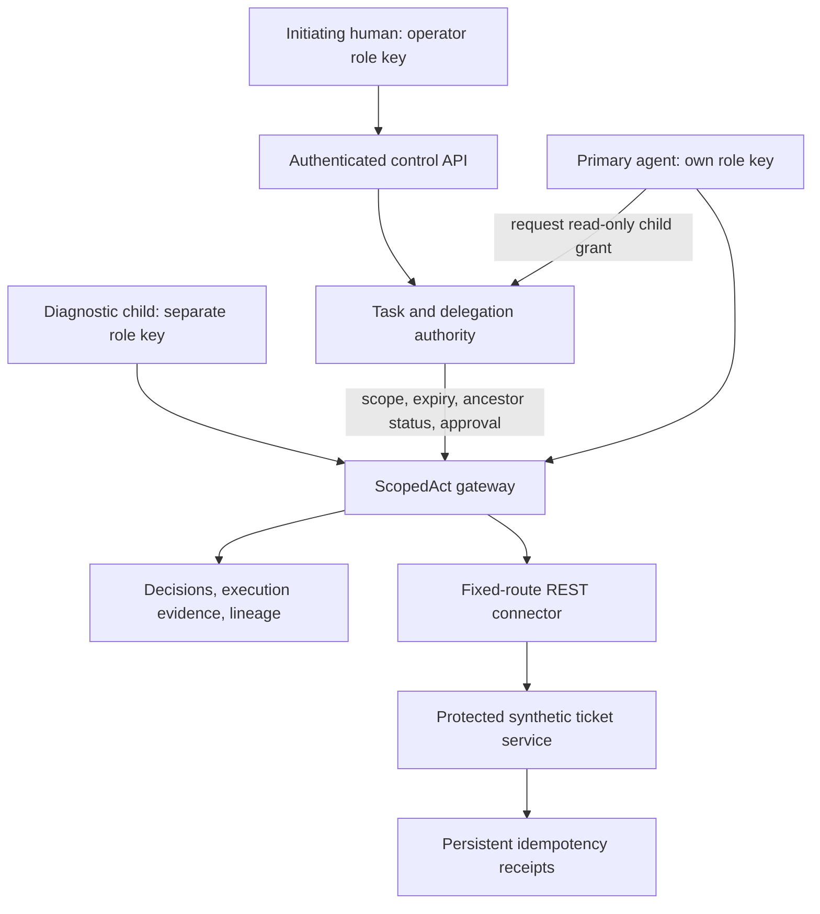

# ScopedAct

### Task-scoped authority for agent tool workflows

ScopedAct independently checks what an agent may do, narrows authority when a task is delegated, requires approval for sensitive actions, and records what was requested and executed.

**v0.14.1 developer preview.** The included ticket pilot uses real HTTP calls, separately authenticated primary/child agent roles, and synthetic tickets. Proposals are scripted; no paid model or cloud account is required.

[Vision](VISION.md) · [Reviewer guide](docs/REVIEW_GUIDE.md) · [Capability status](docs/CAPABILITIES.md) · [Validation](docs/VALIDATION_0.14.1.md) · [CI configuration](.github/workflows/tests.yml)

ScopedAct is an experimental reference implementation for task-scoped authority and accountable tool access. Its scope excludes identity-provider services, prompt-injection detection, and production IAM. It is not a complete solution for autonomous-agent security.

## Start here

From the extracted repository root, with Python 3.10+ and Docker Compose:

```sh
python3 -m venv .venv
. .venv/bin/activate
python -m pip install .
scopedact-pilot init
docker compose -f compose.pilot.yaml up --build -d --wait
scopedact-pilot evaluate --output pilot-results/ticket-evaluation.json
scopedact-pilot evaluate-delegation --output pilot-results/delegation-evaluation.json
python pilot/verify_isolation.py
```

Run `init` once. For an existing v0.13 project, stop its services and run `scopedact-pilot init-child` to provision the new child key without replacing existing keys. See [upgrade details](docs/DELEGATION.md).

The first evaluator exercises the original 17 ticket-workflow checks. The second exercises 19 delegation checks. Each evaluator is a **trusted test harness**, deliberately holding the roles needed to drive its scenarios; neither represents an untrusted agent. The isolated primary/child probe containers each receive only their own key.

## What the delegated workflow demonstrates

1. An authenticated operator grants the primary agent read/update access to T-100.
2. The primary agent delegates only read:T-100 to the diagnostic child agent.
3. The child reads T-100 through ScopedAct and the fixed-route REST ticket connector.
4. Child update attempts and access to T-200 are denied. The child cannot use the parent's grant or approve requests.
5. Parent pause blocks child actions; resume restores otherwise-valid authority.
6. Parent revocation denies subsequent parent and child actions during the workflow.
7. A lineage report reconstructs the initiating operator, parent, child, grant bounds, requests, decisions, and tool outcomes.



HMAC establishes possession of a configured role key, not corporate human or workload identity. Authority is governed separately by stored grants. The pilot supports one parent-to-child hop and subset narrowing; it does not implement advanced graph analysis or semantic intent inference.

## Manual review and evidence

[Manual ticket approval](docs/TICKET_PILOT.md) · [Manual delegation](docs/DELEGATION.md)

```sh
scopedact-pilot lineage --task-id 'COPY_PARENT_TASK_ID'
scopedact-pilot lineage --task-id 'COPY_PARENT_TASK_ID' --json
scopedact-pilot export --output pilot-results/evidence.json
```

Lineage is derived from authenticated callers and stored grant relationships. Default exports omit proposal bodies and read results. Local databases still retain plaintext content for review and reconciliation; use synthetic data.

## Security boundaries

| Path | Boundary |
|---|---|
| Authenticated Docker ticket pilot | Separate primary, child, operator and tool keys; backend on private network; operator CLI |
| Local non-Docker ticket pilot | Same protocol controls, without container network/process separation |
| Older workspace console and labs | Local evaluation only; console has no user authentication |
| Python SDK | Process-local integration with trusted caller identities; not an agent-code sandbox |

The tested Docker network boundary prevents the included primary and child containers from reaching the protected ticket service by name or direct IP. It does not prove isolation for arbitrary agent deployments.

Gateway evidence, ticket data, and idempotency receipts survive tested Docker service restarts. This does not imply replication or backups. Authority can be revoked during a workflow so **subsequent protected actions are denied**; in-flight calls are not canceled or undone.

Read the [pilot security model](docs/PILOT_SECURITY.md), [limitations](docs/LIMITATIONS.md), [publication boundary](docs/PUBLICATION_BOUNDARY.md), and [connector development contract](docs/CONNECTOR_DEVELOPMENT.md).

## Development and review

```sh
python -m unittest discover -s tests -v
python -m pip install build
python -m build
```

GitHub Actions is configured for the Python matrix and both Docker evaluations, isolation probes, and restart checks. Hosted CI is not claimed to have run for this local release. Tests establish behavior only for their documented fixtures.

Reviewer entry point: [REVIEW_GUIDE.md](docs/REVIEW_GUIDE.md). Release changes and response to feedback: [RELEASE_0.14.1.md](docs/RELEASE_0.14.1.md).

The older workspace and SDK remain available: [application guide](docs/APPLICATION_GUIDE.md), [SDK integration](docs/SDK_INTEGRATION.md). MCP, real-model integrations, OIDC, structured intent constraints, policy-version binding, and cloud adapters are roadmap items, not current capabilities.

Stop the pilot with `docker compose -f compose.pilot.yaml down`; volumes persist. Do not expose the loopback-published gateway or the legacy console publicly.

[Contributing](CONTRIBUTING.md) · [Security reporting](SECURITY.md) · [Apache-2.0 license](LICENSE)
