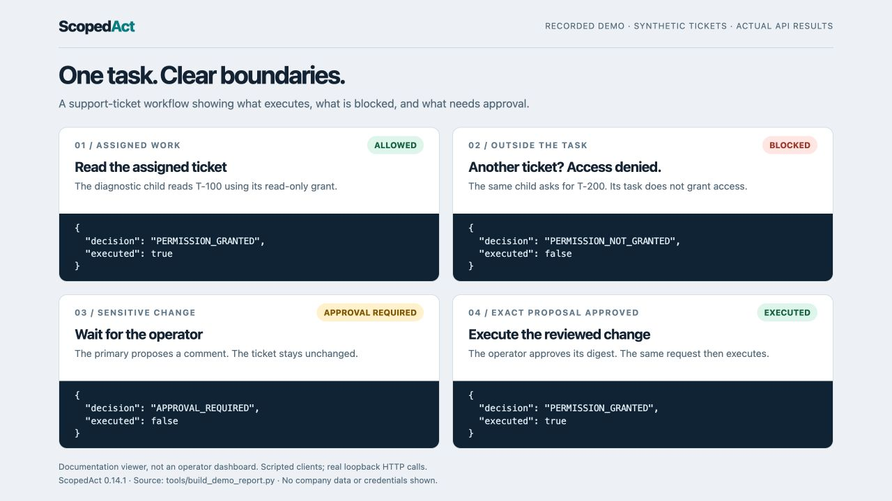
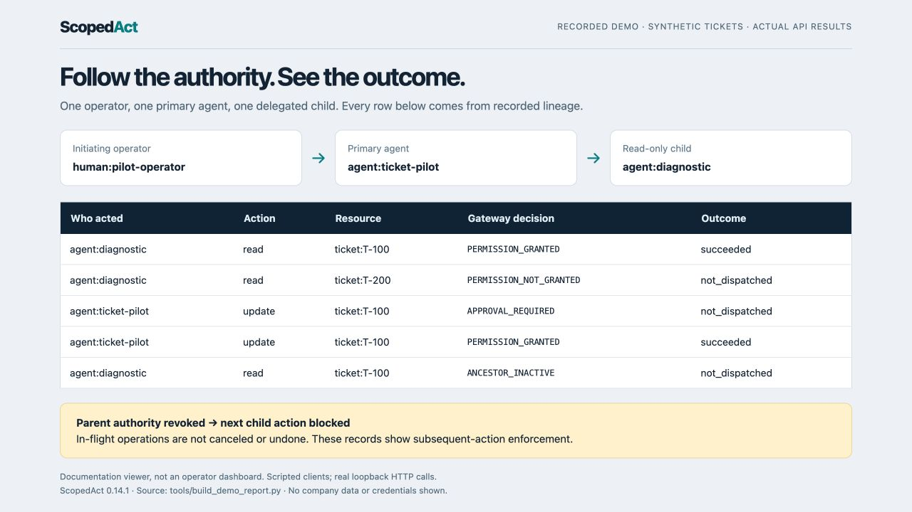

# ScopedAct

## Give agents a task—not unrestricted access.

ScopedAct checks agent tool requests before they execute. Keep permissions limited to the task, require approval for sensitive changes, and see who did what—even when work is delegated.

[](https://github.com/jgoradia3/scopedact/actions/workflows/tests.yml)

**[See the ticket screenshots](#see-it-in-action)** · **[Run the pilot](#try-it-locally)** · **[Review the controls](docs/REVIEW_GUIDE.md)**

## Watch the demo video

**[▶ Watch or download the narrated demo — MP4, 3 minutes](https://github.com/jgoradia3/scopedact/raw/b11c41d050d5d0566622af62117fd35c6f4111e3/docs/media/scopedact-walkthrough.mp4)**

Male-voice walkthrough of the incident console, activity map, and blocked agent request. This edited video uses actual saved console views; it is not a continuous live recording.

The video shows the newer [incident-lab review branch](https://github.com/jgoradia3/scopedact/tree/codex/incident-lab-stabilization), which has not yet been merged into this branch. [Setup and transcript](https://github.com/jgoradia3/scopedact/blob/codex/incident-lab-stabilization/docs/DEMO_VIDEO.md).

## One assignment should not unlock every action

“Investigate ticket T-100” should give an agent access to that ticket—not every customer record. A helper should receive only the permissions it needs. A proposed change should wait when human approval is required.

ScopedAct puts those boundaries in a gateway between the agent and the protected tool. The included support-ticket pilot lets you inspect the behavior with synthetic data, without a cloud account or a paid model.

## See it in action

An operator assigns T-100 to a primary agent. The primary delegates read-only access to a diagnostic child. Here is what happens when they request tool actions:



*Actual pilot API responses, shown in a read-only documentation report. This is a scripted demonstration with synthetic tickets, not a product dashboard or live-model integration. [How these screenshots were captured](docs/SCREENSHOTS.md).*

Delegation also leaves a trail. The report below links the operator, primary, and child to recorded actions. After the operator revokes the parent’s authority, the child’s next request is denied.



*Revocation prevents subsequent protected actions. It does not cancel or undo operations already in flight.*

## What your team can evaluate

| Your question | What the pilot demonstrates |
|---|---|
| Can we limit access to this task? | Exact action/record permissions with an expiration time. |
| Can a helper inherit less access? | A child grant must fit within its parent's permissions and lifetime. |
| Can we review a change before it happens? | Approval of the exact proposed update, with a separate operator role. |
| Can we stop further activity? | Pause or revoke authority; subsequent child actions recheck the parent. |
| Can we tell what happened? | Recorded callers, decisions, tool outcomes, and parent/child relationships. |
| What if a tool response is lost? | Durable request tracking and backend receipts for operator reconciliation. |

The pilot uses real HTTP calls and a fixed-route REST ticket connector. Docker isolates the supplied agent containers from the protected backend. Those controls apply to the documented deployment; integrating another tool requires an adapter and its own validation.

## Try it locally

You need **Python 3.10+**, Git, and **Docker with Compose**. Use synthetic data.

```sh
git clone https://github.com/jgoradia3/scopedact.git
cd scopedact
python3 -m venv .venv
. .venv/bin/activate
python -m pip install .
scopedact-pilot init
docker compose -f compose.pilot.yaml up --build -d --wait
scopedact-pilot evaluate --output pilot-results/ticket-evaluation.json
scopedact-pilot evaluate-delegation --output pilot-results/delegation-evaluation.json
python pilot/verify_isolation.py
```

Expected results: **17/17 ticket checks**, **19/19 delegation checks**, and successful isolation probes for both agent roles. These are defined workflow checks, not claims about every attack or deployment.

Run `init` once; it creates separate local keys. Existing v0.13 users should follow the [upgrade instructions](docs/DELEGATION.md#upgrade-from-v013). The evaluators are trusted test harnesses holding multiple role keys; the isolated agent probes each receive only their own key.

For hands-on use, follow [ticket approval](docs/TICKET_PILOT.md) or [delegation and lineage](docs/DELEGATION.md). Stop services with `docker compose -f compose.pilot.yaml down`; volumes persist.

## Help test the boundaries

Security, IAM, and agent-platform engineers: try the pilot, challenge a control, and tell us what would make it useful in your environment. A reproducible finding about one behavior is valuable.

Start with the **[Reviewer Guide](docs/REVIEW_GUIDE.md)**. Try an out-of-scope request, an approval substitution, or a child action after parent revocation. Include the commit, environment, commands, and expected versus observed behavior in your report. Use [Security reporting](SECURITY.md) for sensitive findings.

The [first hosted CI run](https://github.com/jgoradia3/scopedact/actions/runs/35798797312) passed all four Python jobs (3.10–3.13) and the Docker pilot job, including isolation and restart checks. The suite contains **120 tests**; the SQLite ownership check reported **857 opened, zero unclosed** connections. See [validation details](docs/VALIDATION_0.14.1.md) and the live badge above for the current branch status.

## Project status and scope

**Current package: v0.14.1 · Developer preview for controlled evaluation.** This is a working reference implementation, not a production-ready service. The presentation update does not change the authorization engine or package version.

The ticket pilot uses scripted proposals and separately authenticated development roles using HMAC keys. Those keys prove possession of configured secrets, not enterprise workload identity. Live-model/MCP integration, OIDC, and real Jira, ServiceNow, or cloud adapters remain [roadmap items](docs/ROADMAP.md).

Local databases retain plaintext content; exports omit proposal bodies and read results but retain metadata. Event chains are not immutable third-party evidence. Keep evaluation interfaces on loopback. Read the [current limitations](docs/LIMITATIONS.md) and [pilot security boundaries](docs/PILOT_SECURITY.md) before running it.

## Explore the implementation

[Architecture](docs/ARCHITECTURE.md) · [Capability matrix](docs/CAPABILITIES.md) · [Connector development](docs/CONNECTOR_DEVELOPMENT.md) · [Vision](VISION.md) · [Publication boundary](docs/PUBLICATION_BOUNDARY.md)

The [Python SDK](docs/SDK_INTEGRATION.md) and [older workspace application](docs/APPLICATION_GUIDE.md) are separate evaluation paths. The legacy workspace console lacks user authentication and is not the interface shown in these screenshots.

[Contributing](CONTRIBUTING.md) · [Security reporting](SECURITY.md) · [License](LICENSE)
