# Current architecture — v0.14.1

The primary reference workflow is the authenticated synthetic ticket pilot. It separates the operator, primary agent, diagnostic child, authorization gateway, and protected ticket service. Separately authenticated development roles use HMAC keys; identity assurance is limited to possession of those configured secrets.

```mermaid
flowchart TD
    O[Operator: own HMAC key] --> R[Root task authority]
    P[Primary agent: own HMAC key] --> D[Request bounded child grant]
    R --> D
    D --> C[Diagnostic child: own HMAC key]
    P --> G[ScopedAct gateway]
    C --> G
    R --> G
    O --> A[Exact approval and lifecycle controls]
    A --> G
    G --> T[Fixed-route ticket REST connector]
    T --> S[Protected synthetic ticket service]
    G --> E[Persistent decisions and lineage]
    S --> I[Persistent ticket versions and receipts]
```

## Request and authority flow

1. The operator issues a 15-minute root task with exact read/update permission pairs for one ticket.
2. The primary may request a child grant from its own active root task. The gateway enforces a nonempty permission subset, preserved initiator, and expiry no later than the parent's. Child grant, lifecycle task, and issuance event commit atomically.
3. Signed requests authenticate method, path, body, timestamp, and nonce. API roles restrict issuance, review, intervention, and evidence access. Parent labels come from stored grants, not action callers.
4. Durable execution claims bind each request ID to its canonical proposal. Before dispatch, task, actor, tool, grant bounds, expiration, revocation, and ancestor lifecycle checks must pass.
5. An update additionally requires operator approval of that exact proposal digest within the approval TTL. Resuming an approved request rechecks authority; approval does not override subsequent parent pause or revocation.
6. The connector calls only supported ticket routes. The backend checks its own credential, expected ticket version, and idempotency key. Ambiguous effects require operator reconciliation; the gateway does not automatically retry them.
7. Stored grants and attributed action events supply the operator-only lineage report. Local chained events and backend receipts provide review evidence within the stated trust boundary.

## Deployment and ownership

The gateway joins front and protected Docker networks. The ticket service joins only the protected internal network and publishes no host port. Primary and child probes join only the front network and each receive only their own key. The trusted evaluator holds several role keys to drive deterministic scenarios; it is not an untrusted agent runtime.

The gateway is published at loopback port 8870. Startup prepares secret files and state, then drops to UID/GID 10001. SQLite databases live on named volumes. Each database owner explicitly closes its connection; transaction context managers alone do not close SQLite connections.

One gateway process serializes synchronous invocation and intervention. Acknowledged revocation prevents subsequent protected dispatch; in-flight calls are not canceled or undone. See [limitations](LIMITATIONS.md), [connector contract](CONNECTOR_DEVELOPMENT.md), and [delegation](DELEGATION.md).

## Legacy evaluation paths

The workspace application, unauthenticated operator console, procurement lab, process-local SDK, and optional model/AWS examples remain separate evaluation paths. Their protections differ from the ticket pilot and do not inherit its deployment boundaries. See [application guide](APPLICATION_GUIDE.md), [SDK integration](SDK_INTEGRATION.md), and the legacy section in [limitations](LIMITATIONS.md).
